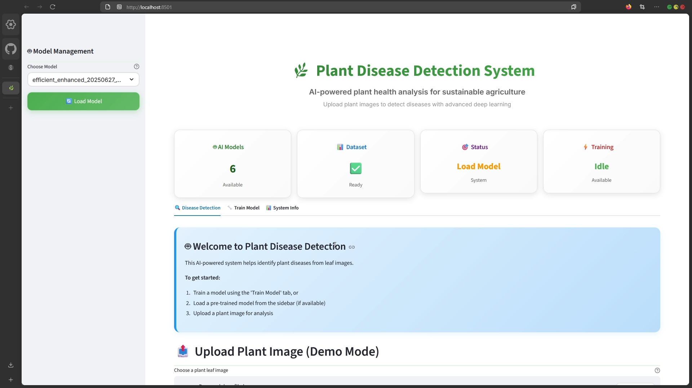
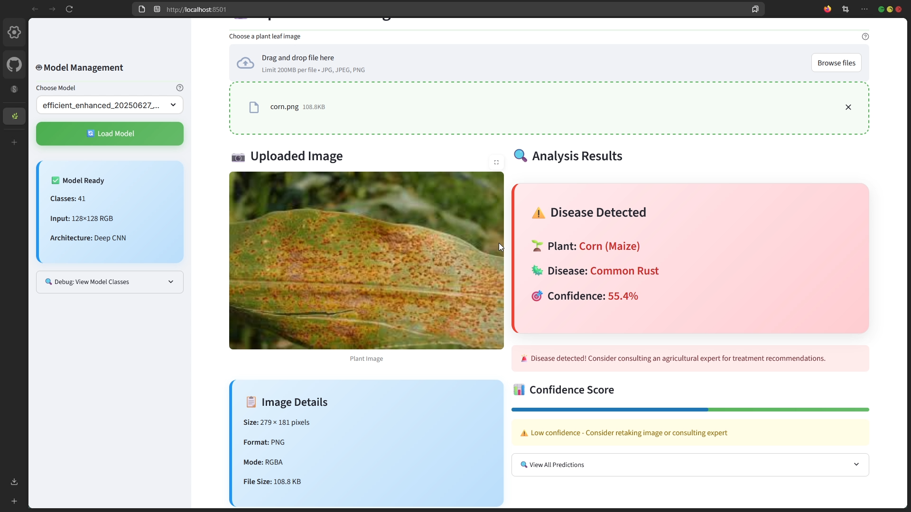
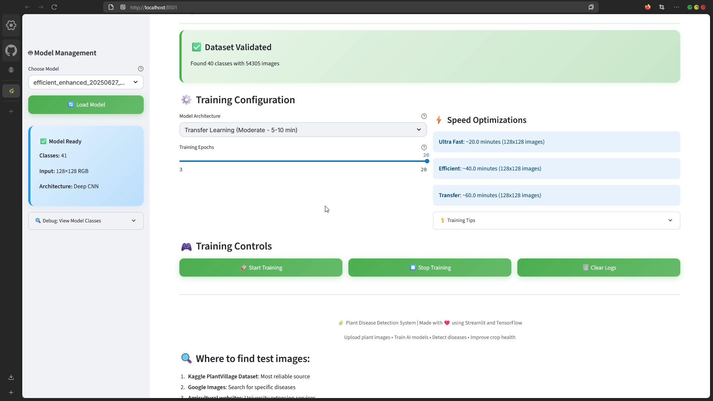
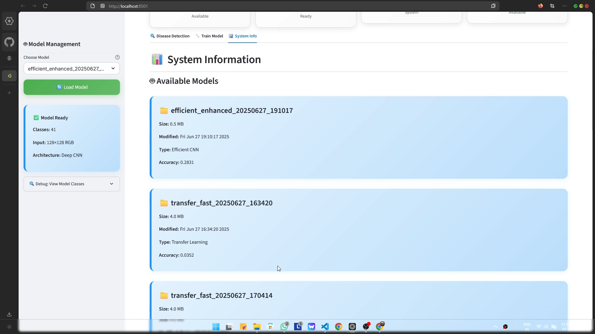

# 🌿 Plant Disease Detection System

> *Because plants can't tell you what's wrong, but our AI will pretend it knows!*

---

## Table of Contents

- [Demo Video & Screenshots](#demo-video)
- [About](#about)
- [Features](#features)
- [Installation](#installation)
- [Usage](#usage)
- [Project Structure](#project-structure)
- [Troubleshooting](#troubleshooting)
- [Contributing](#contributing)
- [License](#license)

---

## Demo Video

> *Because seeing is believing (and reading is for chumps).*

[](https://youtu.be/gZex8zLHtrU)

---

## 📸 Screenshots

<div style="display: flex; flex-wrap: wrap; gap: 10px;">
  
  
  
  
</div>


## About

Welcome to the **Plant Disease Detection System** – the AI-powered tool that helps you identify plant diseases from leaf images. Why consult an expert when you can trust a neural network trained on thousands of images to make a wild guess? This project leverages deep learning (TensorFlow/Keras) and Streamlit to bring you a modern, interactive web app for plant health analysis.

Whether you're a farmer, a botanist, or just someone who likes to upload random pictures of leaves, this tool is for you!

---

## Features

- **Disease Detection**: Upload a plant leaf image and let the AI diagnose it (or at least try).
- **Model Training**: Train your own model on the PlantVillage dataset. Because who doesn't love waiting for epochs to finish?
- **System Info**: See what’s happening under the hood. Or just admire your hardware.
- **Beautiful UI**: Modern, responsive, and full of green gradients. Because plants.
- **Ultra-Fast Mode**: For those who want results before their coffee gets cold (accuracy not guaranteed).
- **Custom & Transfer Learning**: Choose between a custom CNN or transfer learning with state-of-the-art models.
- **Logs & Metrics**: Watch your model learn. Or overfit. Or both.

---

## Installation

> **Warning:** This project requires Python 3.8+ and a working sense of humor.

1. **Clone the repository**
    ```bash
    git clone https://github.com/yourusername/plant-disease-detection.git
    cd plant-disease-detection
    ```

2. **Install dependencies**
    ```bash
    pip install -r requirements.txt
    ```

3. **Download the PlantVillage dataset**
    - [Kaggle PlantVillage Dataset](https://www.kaggle.com/datasets/abdallahalidev/plantvillage-dataset)
    - Extract it to `data/plantvillage/` so you have folders like:
      ```
      data/
        plantvillage/
          Apple___Apple_scab/
          Tomato___Late_blight/
          ...
      ```

4. **Run the launcher**
    ```bash
    python launch.py
    ```
    This will check your environment, install missing packages, and open the app in your browser. If it doesn't, you probably have bigger problems.

---

## Usage

1. **Train a Model**
    - Go to the **Train Model** tab.
    - Pick your favorite model type (or just the fastest).
    - Click "Start Training" and watch the logs. Or go make a sandwich.
    - When done, your model will be saved in the `models/` directory.

2. **Detect Disease**
    - Go to the **Disease Detection** tab.
    - Load a trained model from the sidebar.
    - Upload a clear image of a plant leaf.
    - Get your diagnosis. (Disclaimer: Not a substitute for a real plant pathologist.)

3. **System Info**
    - Visit the **System Info** tab to see your hardware specs, available models, and other details you’ll probably ignore.

---

## Project Structure

```
plant-disease-detection/
│
├── data/                # PlantVillage dataset goes here
├── models/              # Saved models
├── results/             # Training results and plots
├── logs/                # Training logs
│
├── src/
│   ├── data_preprocessing.py
│   ├── model.py
│   ├── train.py
│   ├── evaluate.py
│   ├── utils.py
│
├── config.py            # Project configuration
├── streamlit_app.py     # Main Streamlit app
├── launch.py            # Launcher script
├── requirements.txt     # All the packages you’ll need (and then some)
└── README.md            # This file
```

---


- **What’s inside:**  
  - How to set up the dataset  
  - Training a model (with minimal existential dread)  
  - Uploading images and getting predictions  
  - Navigating the UI like a pro  
  - Watching the AI confidently misdiagnose your houseplants

---

## Troubleshooting

- **App won’t start?**  
  Make sure you’re in the right directory and have Python 3.8+ installed. If not, ask your nearest teenager for help.

- **Training is slow!**  
  Use "Ultra Fast" mode. Or buy a GPU. Or both.

- **Predictions are always the same?**  
  Check your dataset for class imbalance. Or maybe your plant really is that sick.

- **Getting 'Disease: Unknown'?**  
  Make sure your dataset folders follow the `Plant___Disease` naming convention. The AI is picky.

- **Still stuck?**  
  Open an issue or, better yet, try turning it off and on again.

---

## Contributing

Pull requests are welcome! Please make sure your code is cleaner than your desk and your commits are more descriptive than your variable names.

---

## License

MIT License.  
Because open source is the best source.

---

*Made with ❤️, sarcasm, and a lot of
